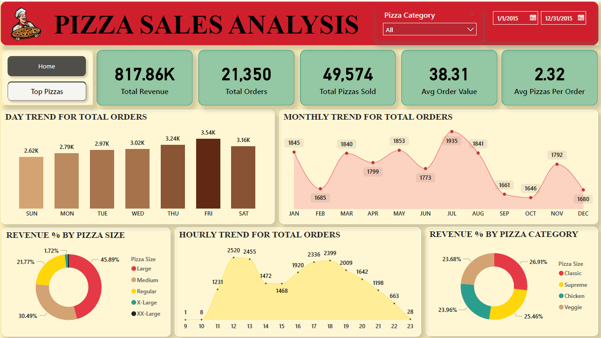
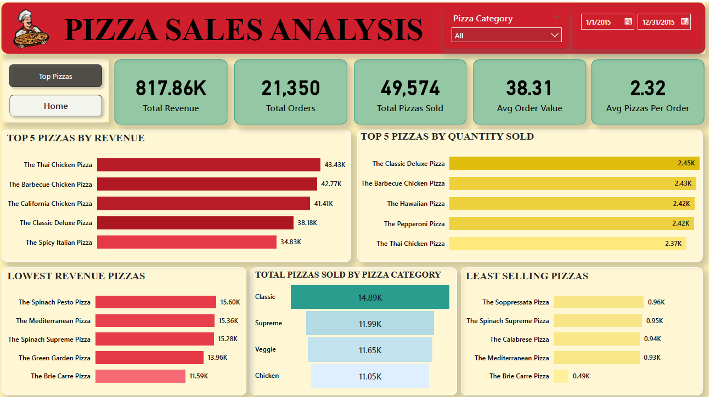

# 🍕 Pizza Sales Analysis

## 📝 Project Overview
This project analyzes pizza sales data to identify **sales performance, customer preferences, and product trends**.  
The dataset includes order details, pizza sizes, categories, ingredients, revenue, and quantities sold.
The analysis was done using **MySQL** for querying and **Power BI** for interactive visualization.

---

## 🎯 Objectives
- Track sales performance over time  
- Identify top- and bottom-performing pizzas  
- Analyze revenue and order patterns by category, size, and time  
- Provide actionable insights to improve sales strategy  

---

## 🔍 Key Analyses

### 1️⃣ Sales Trends
- Daily and monthly revenue trends show growth and seasonal variations  
- Peak sales: Fridays, 12:00–1:00 PM and 4:00–7:00 PM  
- Lowest sales occur between September and December  

### 2️⃣ Pizza Performance
- **Top 5 pizzas** drive the majority of revenue and quantity sold  
- **Bottom 5 pizzas** contribute minimally  
- High revenue pizzas are not always the most frequently sold  

### 3️⃣ Category & Size Insights
- Large and Medium pizzas generate the highest revenue  
- Popular categories: Classic and Supreme  
- XX-Large pizzas contribute the least  

### 4️⃣ Customer Behavior
- Average Order Value (AOV): 38  
- Customers typically order 2–3 pizzas per order  
- Lunchtime and evening hours are busiest  

### 5️⃣ Ingredient Insights
- Classic toppings like cheese dominate sales  
- Specialty pizzas with niche ingredients are among the bottom performers  

---

## 📊 Conclusions
- Top 5 pizzas contribute significantly to total revenue → focus marketing here  
- Bottom 5 pizzas may need re-evaluation → discontinue or re-market  
- Large & Medium pizzas remain priority; Small pizzas can be bundled or discounted  
- Weekends and dinner hours are peak periods → promote off-peak sales to balance revenue  
- Classic toppings dominate → menu optimization potential  
- Track KPIs: Total Revenue, Total Orders, AOV, Avg Pizzas per Order  

---

## 💻 Power BI Dashboard Layout
- **KPIs:** Total Sales, Orders, AOV, Avg Pizzas per Order  
- **Trends:** Sales by Date, Day of Week, Hour of Day  
- **Pizza Performance:** Top 5 & Bottom 5 by Revenue and Quantity  
- **Breakdowns:** Sales by Size, Category  
- **Advanced Visuals:** Heatmap (Day vs Hour), Word Cloud (Ingredients)  

---

## 🛠️ Tech Stack
- **Database:** MySQL (aggregation and filtering queries)  
- **Visualization:** Power BI (interactive dashboard)  
- **Theme:** Warm pizza-inspired colors (reds, yellows, greens, browns)  

---

## 📈 Recommendations
- Focus marketing and promotions on best-selling pizzas  
- Introduce combos or discounts for least-selling pizzas  
- Optimize seasonal menu based on monthly/weekly trends  
- Enhance upselling strategies during peak hours for maximum impact  

--- 

> 💡 Dashboard Preview:

